# A Basic ChatGPT Guide
## Beginner-Friendly ChatGPT — Simple Tips to Help in Everyday Life

*Your friendly handbook for using ChatGPT on your phone — written for first-time users, in plain language.*

---

## Table of Contents

1. **A Note Before You Begin** — page 3
2. **Section 1 — What is ChatGPT?** — page 4
3. **Section 2 — Getting Started on Android** — page 8
4. **Section 3 — Getting Started on iPhone (iOS)** — page 16
5. **Section 4 — Setting Up for Easy Access** — page 21
6. **Section 5 — Talk to ChatGPT Like a Phone Call (Voice)** — page 25
7. **Section 6 — Take a Photo and Ask (Using the Camera)** — page 29
8. **Section 7 — How to Ask Questions (Prompting Basics)** — page 33
9. **Section 8 — 20 Things You Should Try Today** — page 39
10. **Section 9 — Daily Life Use Cases** — page 43
11. **Section 10 — ChatGPT for Senior Citizens** — page 55
12. **Section 11 — ChatGPT for Women & Home Managers** — page 60
13. **Section 12 — Learning New Skills** — page 65
14. **Section 13 — ChatGPT Can Save You Money** — page 71
15. **Section 14 — Things ChatGPT Cannot Do** — page 76
16. **Section 15 — Tips and Tricks** — page 79
17. **Section 16 — Quick Reference Card** — page 83

---

## A Note Before You Begin

Namaste, and welcome!

If you have ever wished you had a smart friend who knows a little bit about almost everything — someone who is always awake, never gets tired of your questions, and never makes you feel small for asking — then this little book is for you.

You do not need to know English well. You do not need to be young. You do not need to be "good with computers." If you can make a phone call, send a WhatsApp message, or take a photo on your phone, you already know enough to use ChatGPT.

This guide will hold your hand, step by step. We will go slowly. Nothing here is difficult. By the end, you will be able to ask ChatGPT for recipes, help with your children's homework, advice for your shop, government form information, and so much more — all in your own way of speaking.

Take your time. There is no hurry. Keep your phone next to you as you read, and try each step yourself. Learning by doing is the best way.

Let us begin.

---

# Section 1 — What is ChatGPT?

## Think of it like a very knowledgeable friend

Imagine you have a friend who has read thousands of books, newspapers, and websites. This friend knows a little about cooking, a little about farming, a little about health, a little about studies, a little about business — almost everything.

Now imagine this friend lives inside your phone, is awake 24 hours a day, all 7 days of the week, and is always happy to help. You can ask this friend a question at 2 in the afternoon or 2 in the night. The friend never gets angry, never gets tired, and never says "ask me later."

**That friend is ChatGPT.**

ChatGPT is a computer program that you can talk to using normal language — the same way you talk to a person. You type your question (or even speak it out loud), and ChatGPT writes back an answer in simple words.

## What does "AI" mean?

You may have heard the word **"AI."** It stands for **Artificial Intelligence.** Do not let the big words scare you.

- **"Artificial"** means "man-made" — something created by people, not born naturally.
- **"Intelligence"** means "the ability to think and understand."

So AI simply means a **man-made thinking helper.** Just like a calculator is a man-made helper for maths, AI is a man-made helper for questions, writing, and ideas.

ChatGPT is one type of AI. The "GPT" part is just its name — you do not need to remember what it stands for. Think of it like the brand name of a scooter. You ride the scooter; you do not need to know what every letter means.

## How is it different from Google?

Many people ask: "I already have Google. Why do I need this?"

Good question! Here is the simple difference:

- **Google** gives you a *list of websites* to read. You then have to open each link, read everything, and find your answer yourself. It is like going to a big library and being handed ten books — you still have to find the right page.
- **ChatGPT** gives you *the answer directly,* in your own words, like a person explaining it to you. It is like asking a knowledgeable shopkeeper who tells you exactly what you need in one clear reply.

And the best part: you can keep asking follow-up questions. If you do not understand the answer, you can say "explain more simply," and it will try again — patiently, every time.

## Why is ChatGPT useful in daily life?

Here are just a few ways ordinary people across India use ChatGPT every day:

- A **mother** asks for a quick dinner recipe using only what is left in her kitchen.
- A **student** asks ChatGPT to explain a difficult science chapter in simple Hindi.
- A **farmer** asks which fertiliser suits his wheat crop in the winter season.
- A **shopkeeper** asks it to write a nice WhatsApp message to attract customers for a festival sale.
- A **grandfather** asks it to explain how to fill an online form for his pension.
- A **young woman** preparing for a government exam asks it to make practice questions.
- A **father** asks how to make a monthly budget for the family.

The list never ends. Whatever question comes to your mind in daily life, you can ask it.

## Is it really free?

**Yes!** ChatGPT has a **free version** that anyone can use. You do not have to pay anything to download it or to ask everyday questions. This free version is more than enough for almost everything in this guide.

There is also a paid version (called "ChatGPT Plus") that costs money every month and gives some extra features. **You do not need it.** For everything in this book, the free version works perfectly. So do not worry — you will not be asked to pay.

> **Remember:** Downloading the app is free. Making an account is free. Asking questions is free. If any website or person asks you to pay money to "activate ChatGPT," it is a fraud — ignore it.

## A quick promise to you

By the time you finish this guide, you will be able to do all of this yourself, without anyone's help. So keep reading, and let us set it up on your phone.

---

# Section 2 — Getting Started on Android

*(If you have an iPhone instead, you can skip to Section 3)*

We will now install ChatGPT together. Just follow along, one step at a time. Keep your phone unlocked and ready.

## Step 1 — Open the Google Play Store

1. Look on your phone's screen for an icon that looks like a **colourful triangle** (it has red, yellow, green, and blue colours, like a small "play" arrow).
2. Below it, you will usually see the words **"Play Store."**
3. Tap on it once with your finger.

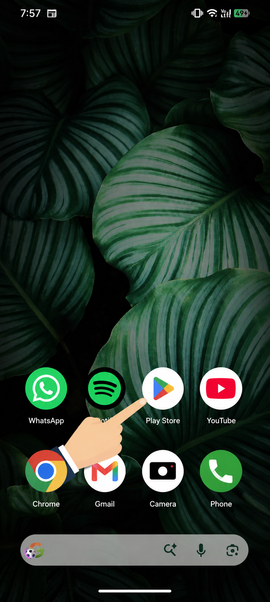

If you cannot find it, swipe up from the bottom of your screen to see all your apps, then look for "Play Store."

## Step 2 — Search for ChatGPT

1. When the Play Store opens, you will see a **search bar** at the top. It usually says "Search for apps & games." OR you will see a **search icon** at the bottom centre which looks like a magnifying glass 🔍.
2. Tap on that search bar or icon. A keyboard will pop up from the bottom.
3. Type the word: **chatgpt**

   (Type it slowly, letter by letter: c-h-a-t-g-p-t. Do not worry about capital letters.)
4. Tap the **search button** (it looks like a magnifying glass 🔍) on your keyboard.

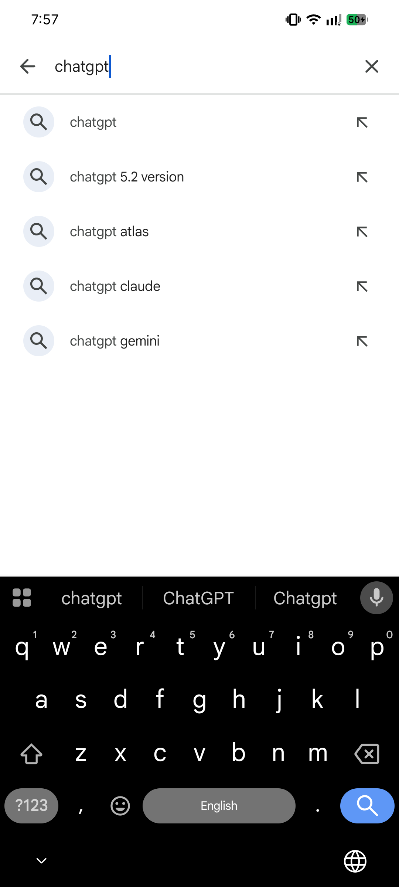

## Step 3 — Find the correct app

This is an **important** step. Many apps may appear, and some are copies or fakes. We want the **real, official** one.

Look for the app that says:

- **Name:** ChatGPT
- **Made by (Developer):** **OpenAI**

The maker's name **"OpenAI"** is written in small grey letters just below the app name. This is how you know it is the real one. Many crores of people have already downloaded it, so it will be one of the top results.

The icon is a **black or white circle with a knot-like flower pattern** in the middle.

> **Be careful:** Do not download apps with names like "Chat GBT," "ChatGPT AI Pro," or anything that is NOT made by "OpenAI." Those may be fakes that show too many advertisements or ask for money. Always check the maker is **OpenAI.**

## Step 4 — Download and Install

1. Tap on the official ChatGPT app to open its page.
2. You will see a green **"Install"** button. Tap it once.
3. The app will start downloading. You will see a small circle filling up, showing the progress. This takes a few seconds to a minute, depending on your internet speed.
4. When it is done, the "Install" button will change to an **"Open"** button.

> **Tip:** Use a Wi-Fi connection if you have one, so you do not use up your mobile data. But it is a small app, so mobile data is also fine.

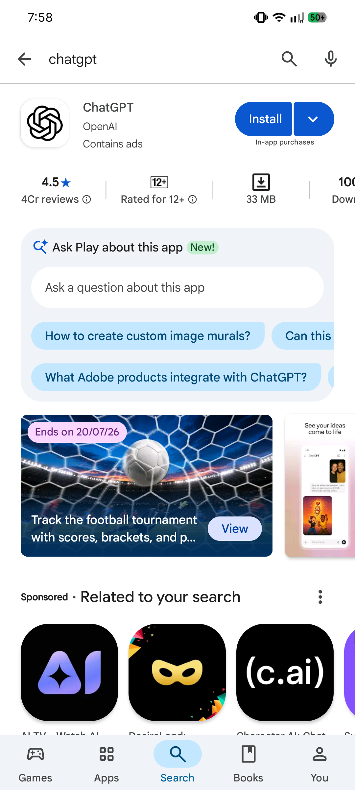

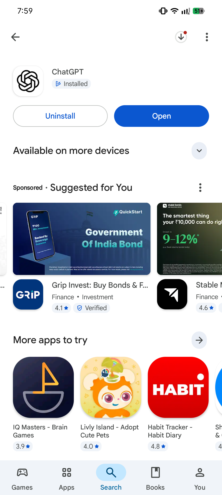

## Step 5 — Open the app

Tap the **"Open"** button. (From next time, you can also open it directly by tapping the ChatGPT icon, which is now on your phone's home screen.)

The first time it opens, you will see a welcome screen. Now we will create your account.

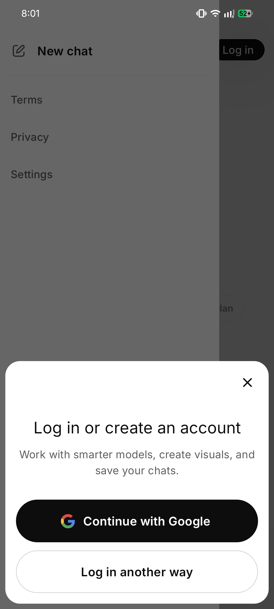

## Step 6 — Create your account

To use ChatGPT, you need a free account. This is like getting a library card — it remembers who you are so your chats are saved for you. Making it takes two minutes.

On the welcome screen, you will see a few buttons. Let us look at your choices:

- **Continue with Google** — the easiest way if you already have a Gmail account.
- **Continue with Apple** — only on iPhones (ignore on Android).
- **Sign up** — to make a new account using any email address.

We will explain the **two easiest ways** below. Pick whichever suits you.

### The Easy Way — Sign up with Google (Recommended)

If you already use Gmail (most Android phones already have a Google account set up), this is the simplest method. No new password to remember!

1. Tap **"Continue with Google."**
2. A list of the Google accounts on your phone will appear. Tap the one you want to use (it will show your email address, ending in **@gmail.com**).
3. It may ask "ChatGPT wants to use Google to sign in" — tap **"Continue"** or **"Allow."**
4. That's it! Your account is created. No password, no email to verify.

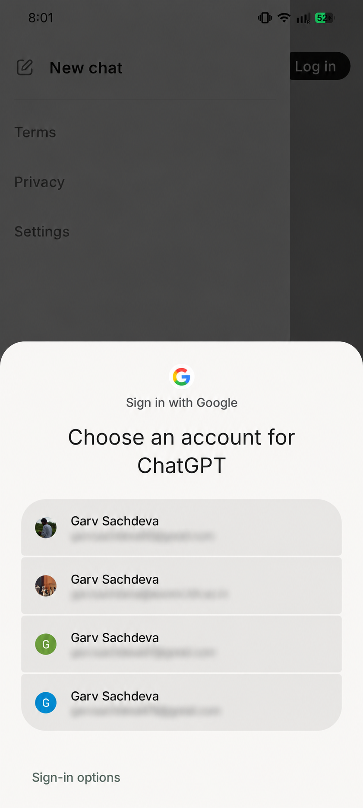

### The Other Way — Sign up with Email

If you want to use a different email, or you do not have Gmail, follow these steps:

1. Tap **"Sign up."**
2. Type your **email address** carefully (for example: ramesh.kumar@gmail.com). Double-check there are no spelling mistakes.
3. Tap **"Continue."**
4. Now create a **password.** This is a secret word only you know. It must usually be at least 8 letters/numbers long.
   - **Make it something you can remember but others cannot guess.** Do not use "12345678" or "password."
   - A good trick: pick a word plus numbers that mean something only to you, like a pet's name and a year.
   - **Write your password down** somewhere safe (a diary), because you will need it next time you log in.
5. Tap **"Continue."**

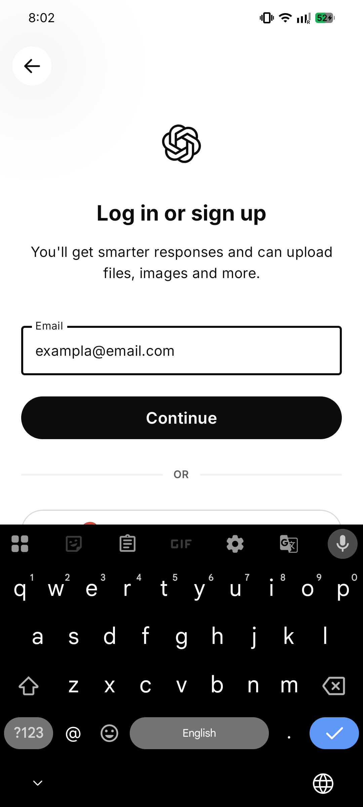

## Step 7 — Verify your email

If you signed up with email, ChatGPT needs to make sure the email is really yours. This is called **"verifying."**

1. ChatGPT will say: "We sent a code/link to your email."
2. Leave ChatGPT open. Open your **email app** (like Gmail) on the same phone.
3. Look for a new email from **"OpenAI."** (If you don't see it in a minute, check the "Spam" or "Promotions" folder.)
4. Open that email. It will have either:
   - A **button or link** that says "Verify email address" — just tap it, OR
   - A **6-digit code** (like 4 8 2 9 1 7) — note it down, go back to ChatGPT, and type it in.
5. Once done, your email is verified. 

## Step 8 — Tell ChatGPT a little about you

After your account is made, it may ask for:

- **Your name** (you can give your first name, like "Ramesh" or "Sunita").
- **Your birthday / date of birth** (this is to confirm you are old enough; you must usually be 13 or older, often 18).

Fill these in and tap **"Continue."** These are simple, normal questions — nothing to worry about.

## Step 9 — Allow or skip permissions

The app may ask for permission to send **notifications** (small messages). You can tap **"Allow"** or **"Don't allow"** — both are fine. It does not affect your use.

## Step 10 — You're in! Your first screen

Congratulations! 🎉 You will now see the main ChatGPT screen. Let us understand it:

- In the **middle/top**, you may see "ChatGPT" and some example questions.
- At the **bottom**, there is a long box that says **"Message"** or **"Ask anything."** This is where you type your questions.
- To the **right of that box** is an arrow or microphone — the arrow **sends** your message; the microphone lets you **speak** instead of typing.
- In the **top-left corner**, there are usually three lines (☰) or a small icon. Tapping it shows your **past chats** — like a history of everything you asked.

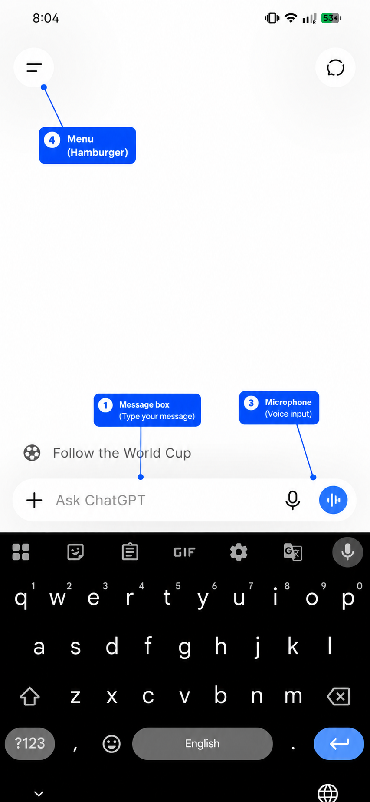

## Step 11 — Say your first hello

Let us test it! Tap the message box at the bottom and type:

> **Hello! Can you help me in simple language?**

Then tap the send arrow. Within a few seconds, ChatGPT will reply warmly. 

**You did it!** You now have ChatGPT working on your phone. From here on, everything is just asking questions — which we will learn properly in Section 7.

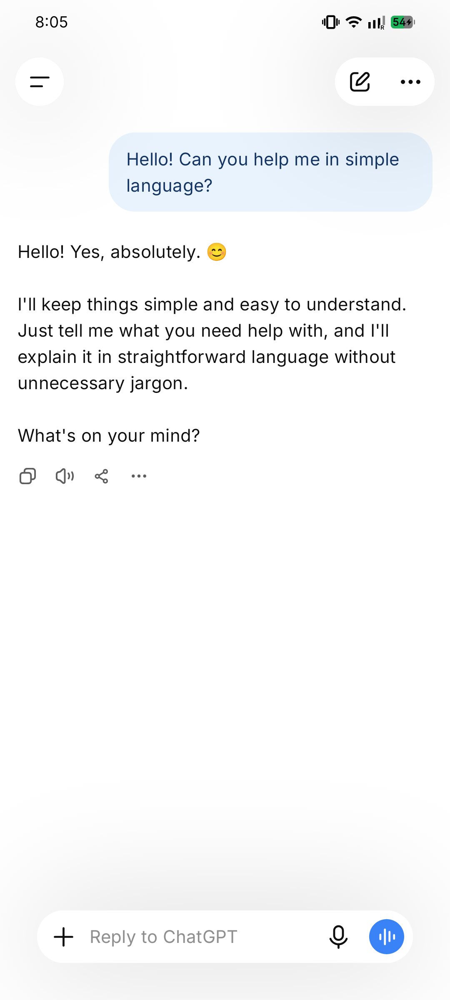

---

# Section 3 — Getting Started on iPhone (iOS)

*(If you have an Android phone, you already finished in Section 2. You can skip ahead to Section 4.)*

If your phone is an **iPhone** (made by Apple), the steps are almost the same as Android — only the "shop" we download from is different. On iPhone, the app shop is called the **App Store** (not Play Store).

## Step 1 — Open the App Store

1. Look for a **blue icon** with a white letter **"A"** made of drawing tools (like a pencil and ruler shaped into an A).
2. Below it is written **"App Store."**
3. Tap on it.

## Step 2 — Search for ChatGPT

1. At the bottom-right of the App Store, tap the **"Search"** button (a magnifying glass 🔍).
2. Tap the search bar at the top and type: **chatgpt**
3. Tap the blue **"Search"** button on the keyboard.

## Step 3 — Find the official app

Just like on Android, make sure you pick the **real** one:

- **Name:** ChatGPT
- **Made by:** **OpenAI**

Check that the maker says **"OpenAI."** Avoid copycats with slightly different names.

## Step 4 — Download (Get) the app

1. Tap the **"GET"** button next to the app (on iPhone, the download button says "GET" instead of "Install").
2. Your iPhone may ask you to confirm using:
   - **Face ID** (look at your phone), or
   - **Touch ID** (place your finger on the button), or
   - Your **Apple ID password.**
3. The app will download. When finished, the button changes to **"OPEN."**

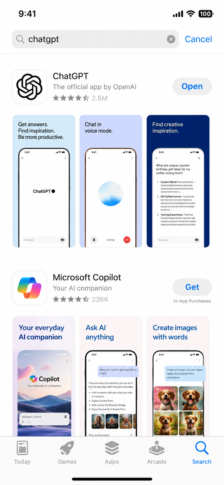

## Step 5 — Open and create your account

1. Tap **"OPEN"** (or tap the new ChatGPT icon on your home screen).
2. On the welcome screen, you have three easy choices:
   - **Continue with Apple** — uses your existing Apple ID. Very easy on iPhone.
   - **Continue with Google** — if you have a Gmail account.
   - **Sign up** — to use any email address.

The steps after this are **exactly the same as Android** (see Section 2, Steps 6 to 8): choose a sign-in method, verify your email if needed, and enter your name and birthday.

> **iPhone bonus:** "Continue with Apple" can hide your real email for privacy. This is safe and fine to use.

## Step 6 — The main screen (same as Android)

Once you are in, the ChatGPT screen looks the same as on Android:

- A **message box** at the bottom to type your question.
- A **send arrow** and a **microphone.**
- A **menu** at the top-left to see your past chats.

## Are there any differences from Android?

Honestly, very few. For a normal user, **ChatGPT works the same on iPhone and Android.** The only real differences are:

| Thing | Android | iPhone |
|---|---|---|
| App shop name | Play Store | App Store |
| Download button | "Install" | "GET" |
| Extra sign-in option | — | "Continue with Apple" |
| Confirm download | (usually none) | Face ID / Touch ID / password |

Everything else — asking questions, voice input, saving chats — is identical. So whichever phone you have, the rest of this guide applies fully to you.

---

# Section 4 — Setting Up for Easy Access

Now that ChatGPT is installed, let us make it **quick and comfortable** to use — so you can open it in one tap and use it in your own language.

## 1. Put ChatGPT on your home screen

When you install an app, its icon usually goes on your home screen automatically. But if you cannot find it easily, here is how to keep it handy.

### On Android

1. Swipe up from the bottom of the screen to open the **app drawer** (the full list of apps).
2. Find the **ChatGPT** icon.
3. **Press and hold** the icon with your finger for a moment.
4. Without lifting your finger, **drag** it to an empty spot on your home screen, then let go.

Now ChatGPT sits on your main screen, ready in one tap.

**Bonus — Add a search widget (Android):**
1. Press and hold on an empty area of your home screen.
2. Tap **"Widgets."**
3. Scroll to find **ChatGPT.**
4. Press, hold, and drag its widget onto your home screen. A widget lets you start a chat or speak directly from the home screen.

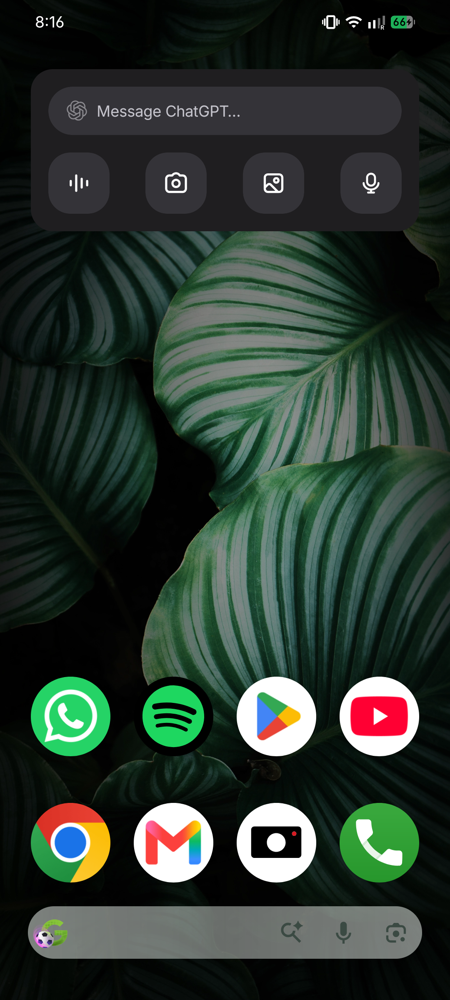

### On iPhone

The icon is usually added automatically. To make sure:
1. Find ChatGPT (swipe down on the home screen and type its name in search if needed).
2. **Press and hold** the icon.
3. Choose **"Add to Home Screen"** if it is in the App Library.

**Bonus — Add a widget (iPhone):**
1. Press and hold an empty area of the home screen until icons jiggle.
2. Tap the **"+"** at the top-left.
3. Search for **ChatGPT,** choose a widget size, and tap **"Add Widget."**

## 2. Type and chat in your own language

Here is wonderful news: **ChatGPT understands and replies in Indian languages!** You can chat in Hindi, Bengali, Tamil, Telugu, Marathi, Gujarati, Kannada, Punjabi, Odia, Urdu, and more.

You have **three easy ways** to use your own language:

### Way 1 — Just ask in your language using English letters

You can type the way many people text on WhatsApp — your language written in English letters. For example:

> **"Mujhe aloo gobi banane ki recipe batao"**

ChatGPT will understand and can reply in Hindi or in the same style. Easy!

### Way 2 — Type in your own script using the phone's keyboard

Your phone can type in your own script (Devanagari for Hindi, Tamil script, etc.).

**On Android (Gboard):**
1. While typing, tap the small **globe icon 🌐** or the comma-and-globe near the space bar.
2. If your language is not there, go to phone **Settings → System → Languages & input → On-screen keyboard → Gboard → Languages → Add keyboard,** and add your language (for example, "Hindi" or "Tamil").
3. Now you can switch to your language keyboard by tapping the globe 🌐, and type in your own script.

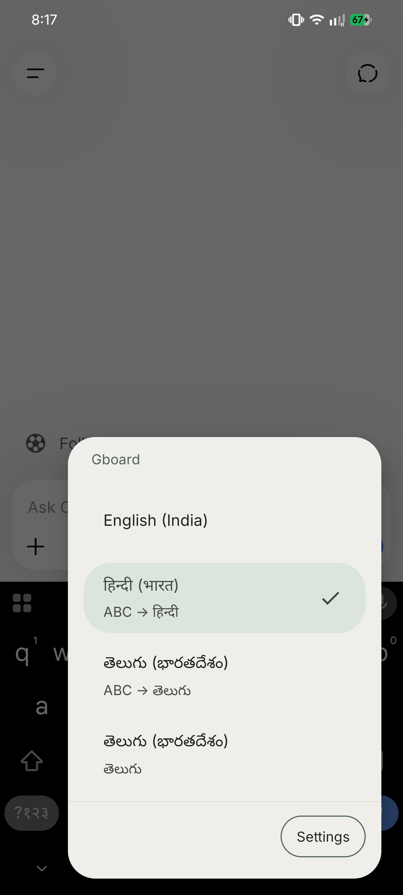

**On iPhone:**
1. Go to **Settings → General → Keyboard → Keyboards → Add New Keyboard.**
2. Choose your language (for example "Hindi (Devanagari)" or "Tamil").
3. While typing, tap the globe 🌐 to switch.

### Way 3 — Tell ChatGPT which language to reply in

Simply tell it once! Type:

> **"Please always reply to me in simple Tamil."**

And it will continue in Tamil for the rest of the chat. You can do this for any language.

## 3. You can also speak instead of typing

If typing is slow or hard, you do not have to type at all — you can **speak** to ChatGPT in your own language, just like talking on the phone. This is so important for so many people that we have given it its own section. See **Section 5 — Talk to ChatGPT Like a Phone Call** next.

---

# Section 5 — Talk to ChatGPT Like a Phone Call (Voice)

This may be the **most important section in the whole book.** If reading and typing feel slow or difficult — maybe your eyes tire, your fingers are not used to the keyboard, or English letters confuse you — then this is your golden door.

**You can simply talk to ChatGPT, in your own language, the same way you talk on a phone call.** It listens, understands, and even talks back. No typing needed at all.

## Why voice is the easiest way

- **No typing.** Just speak, like leaving a WhatsApp voice message.
- **Your own language.** Speak in Hindi, Tamil, Bengali, Marathi — whatever is comfortable. ChatGPT understands.
- **Hands-free.** Great while cooking, farming, or holding a baby.
- **No spelling worries.** You don't need to know how to spell anything.

> **Think of it like this:** You know how you send voice messages on WhatsApp to your family instead of typing? ChatGPT works the same way — but instead of a family member, you are talking to that knowledgeable friend who answers every question.

## Two kinds of voice — know the difference

ChatGPT gives you **two** ways to use your voice. Both are easy.

### Way 1 — Speak your question (voice-to-text)

This turns your spoken words into typed text, then ChatGPT replies in writing.

1. Open ChatGPT.
2. Look at the message box at the bottom. On the right side you will see a small **microphone icon 🎤.** Tap it.
3. The first time, your phone may ask "Allow ChatGPT to record audio?" — tap **"Allow"** (this is safe; it is needed to hear you).
4. Now **speak your question clearly** in your language. For example, say: *"Meri beti ko bukhaar hai, use kya khaana dena chahiye?"* ("My daughter has a fever, what food should I give her?")
5. Your spoken words turn into text in the box. Check it looks right, then tap the **send arrow.**
6. ChatGPT replies in writing, which you can read or have read aloud.

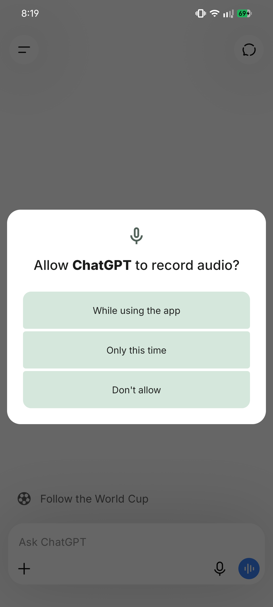

### Way 2 — Full voice conversation (talk and listen, like a real call)

This is the magical one. You **talk,** and ChatGPT **talks back out loud** — a real back-and-forth conversation, just like a phone call. Perfect for elders and anyone who prefers listening to reading.

1. In ChatGPT, look for the **headphone or sound-wave icon** (usually at the bottom-right, near the message box).
2. Tap it. A round, glowing circle appears — this means ChatGPT is **listening.**
3. Just **start speaking** naturally, in your language. No need to tap anything else.
4. Pause when you finish. ChatGPT will **answer out loud** in a friendly voice.
5. To ask the next thing, just keep talking. It remembers the conversation.
6. When done, tap the **"X"** or close button to end the call.

> **Tip:** This is also a wonderful, private way to **practise spoken English.** Talk to it in English, and it will gently reply — no one is judging you, and you can repeat as many times as you like.

## Three real examples to try with your voice

Open the voice mode and simply *say* these out loud, in your own language:

**Example 1 — Health:**
> 🎤 *"My daughter has a fever. What food should I give her?"*

ChatGPT will suggest light, easy foods like khichdi, soups, fruits, and plenty of fluids — and remind you to see a doctor if the fever is high or lasts long.

**Example 2 — Cooking with what you have:**
> 🎤 *"I have 2 onions, 3 tomatoes, and some potatoes. What can I cook?"*

ChatGPT will give you 2–3 simple dish ideas — like aloo-tamatar sabzi or a quick curry — with easy steps, all from your spoken list.

**Example 3 — Understanding a government scheme:**
> 🎤 *"Explain the PM Kisan Yojana in simple words."*

ChatGPT will explain it plainly: what it is, who it helps (small farmers), and the basic idea of the support given — and remind you to confirm details on the official government website.

## A few tips for clear voice results

- **Speak in a quiet place** if you can, so it hears you well.
- **Talk at a normal, calm speed** — no need to shout or rush.
- If it hears a word wrong, just **say it again** or correct it — it is patient.
- You can **mix languages** (Hindi + English words) — ChatGPT understands the way we really talk.

> **Many people who struggle with typing become daily ChatGPT users the moment they discover voice.** Try it today, and show it to a family member who finds typing hard. It changes everything.

---

# Section 6 — Take a Photo and Ask (Using the Camera)

Here is something most people do not know: **ChatGPT can SEE pictures.** You can take a photo with your phone, send it to ChatGPT, and ask a question about it. For many people, this is even more useful than typing — because you can just *show* it your problem.

Think of it like showing a photo to a knowledgeable friend and asking, *"What is this? What should I do?"*

## How to send a photo and ask about it

1. Open ChatGPT and start a chat.
2. Near the message box, look for a **"+" icon** or a **camera/photo icon** 📷. Tap it.
3. You will get two choices:
   - **Take Photo** — opens your camera to click a new picture, OR
   - **Photo Library / Gallery** — to choose a picture you already have.
4. The first time, allow ChatGPT to use your **camera** or **photos** when it asks (tap "Allow"). This is safe.
5. After the photo is attached, **type or speak your question** about it — for example, *"What is wrong with this plant?"*
6. Tap send. ChatGPT looks at the photo and answers.

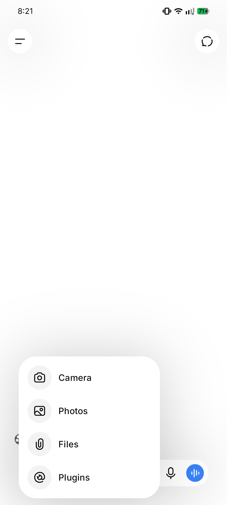

## Six powerful ways to use the camera

### 1. Sick plant or crop 🌱
Take a photo of a leaf with spots or a wilting plant and ask:
> *"My tomato plant leaves have these yellow spots. What could be the problem and what can I do?"*
ChatGPT can suggest likely causes (pest, too much/little water, disease) and simple remedies. *(For crops, also confirm with your local Krishi Vigyan Kendra.)*

### 2. Understand a medicine strip 💊
Photograph the medicine packet/strip and ask:
> *"What is this medicine used for, and what are common precautions?"*
It can explain the general purpose in simple words.
> **⚠️ Very important:** This is only for understanding. **Never** start, stop, or change a medicine based on this. Always follow your doctor's and pharmacist's instructions for dose and safety.

### 3. Fill a government form 📄
Take a photo of a confusing form and ask:
> *"Explain what this form is asking, field by field, in simple Hindi."*
ChatGPT can walk you through what each box means. *(Do not photograph pages that already contain your Aadhaar number, bank details, or signature — keep those private.)*

### 4. Read a handwritten note ✍️
Photograph handwriting (a note, a recipe, an old letter) and ask:
> *"Please read this note and type it out clearly for me."*

### 5. Help with a child's homework 📐
Take a photo of a maths sum or a textbook question and ask:
> *"Explain how to solve this problem, step by step, so I can teach my child."*

### 6. Understand an appliance error or screen ⚙️
Photograph a washing machine display, an error message, or any screen and ask:
> *"My washing machine is showing this. What does it mean and what should I do?"*

## A full example conversation

**You do:** Take a photo of a lemon plant leaf with white spots.

**You type or say:**
> "What is this white powder on my lemon plant leaves? How can I treat it with simple home methods?"

**ChatGPT replies:**
> From your photo, the white powdery coating on the leaves looks like it could be **powdery mildew,** a common fungal problem, especially in humid or shady conditions.
>
> **Simple things you can try:**
> - **Improve airflow:** Trim very crowded branches so air and sunlight reach the leaves.
> - **Neem spray:** Mix a little neem oil with water and a drop of mild soap, and spray on the affected leaves in the evening.
> - **Baking soda spray:** A spoon of baking soda in a litre of water can help control the fungus.
> - **Remove badly affected leaves** and do not water from the top onto the leaves.
>
> Watch for a week. If it spreads a lot, take a leaf sample to your local nursery or **Krishi Vigyan Kendra** for exact advice.

## Privacy reminder for photos

- ✅ Fine to photograph: plants, medicines (for info), appliances, homework, general forms.
- ❌ Avoid photographing: your Aadhaar card number, bank passbook, ATM card, cheques, passwords, or anyone's private documents.

Treat photos the same as words — never share secret or personal information.

---

# Section 7 — How to Ask Questions (Prompting Basics)

This is the **heart** of the whole guide. Once you learn how to ask good questions, ChatGPT becomes ten times more useful. Don't worry — it is very simple, and we will use lots of examples.

## What is a "prompt"?

A **"prompt"** is just a fancy word for **your question or request** — whatever you type to ChatGPT.

- If you type *"How do I make tea?"* — that is a prompt.
- If you type *"Write a birthday message for my mother"* — that is a prompt.

So whenever this guide says "prompt," just think **"the thing I ask."** That's all.

## The golden rule: Talk like you would to a helpful person

You do not need special words or computer language. Just write the way you would explain to a knowledgeable neighbour. ChatGPT understands normal, everyday language.

## Good questions vs. weak questions

The secret to a great answer is a **clear, specific** question. Let us see the difference.

| Weak question (too short/vague) | Good question (clear and specific) |
|---|---|
| "Recipe" | "Give me a simple recipe for dal tadka for 4 people, using toor dal." |
| "Help with money" | "Help me make a monthly budget for a family of 4 with ₹20,000 income." |
| "Tell me about Aadhaar" | "What documents do I need to apply for a new Aadhaar card for my 5-year-old child?" |
| "Health" | "My 8-year-old has a mild fever. What simple home care can I try tonight?" |

See the pattern? The good questions tell ChatGPT:
- **Who** it is for (4 people, a child, a family),
- **What** exactly you want (dal tadka, a budget, documents),
- **Any limits** (₹20,000 income, toor dal only).

## A simple recipe for a great prompt

Try to include these three things when you can:

1. **What you want** — "Write a message…", "Explain…", "Give me a list…"
2. **Some details** — for whom, how many, what budget, what you already have.
3. **How you want the answer** — "in simple Hindi," "in short points," "like explaining to a child."

**Example putting it all together:**

> **"Explain photosynthesis to my 10-year-old daughter in very simple Hindi, using an example from our kitchen garden."**

This single sentence tells ChatGPT the topic, the audience, the language, and the style. The answer will be excellent.

## How to ask follow-up questions

This is one of the best features. ChatGPT **remembers** what you were just talking about in the same chat. So you can keep going, like a real conversation.

Suppose ChatGPT gives you a dal recipe. You can then simply say:

- *"Make it less spicy."*
- *"I don't have tomatoes. What can I use instead?"*
- *"Now tell me what to cook with it."*
- *"Explain that last step again, more slowly."*

You do **not** need to repeat the whole question. Just continue, the way you would chat with a friend.

## If you don't like the answer, just say so

ChatGPT is patient. If the reply is too long, too hard, or not what you wanted, tell it:

- *"That was too long. Give me only 5 short points."*
- *"I didn't understand. Explain like I'm 5 years old."*
- *"Give me a cheaper option."*
- *"Reply in Marathi, please."*

It will happily try again. There is no limit to how many times you can ask.

## Ten starter prompts to try right now

Here are easy questions you can copy and try, to build your confidence:

1. "Suggest a simple vegetarian dinner I can cook in 30 minutes."
2. "Explain how to use UPI to send money, step by step."
3. "Write a short, polite leave application to my office for 2 days."
4. "Give me 5 easy exercises for back pain I can do at home."
5. "Make a packing list for a 3-day trip to visit relatives."
6. "Explain the rules of cricket to someone who has never seen it."
7. "Suggest 10 good name ideas for a small tailoring shop."
8. "Help my son learn the 7 times table with a fun trick."
9. "What are simple ways to save electricity at home?"
10. "Translate 'Wishing you a happy and prosperous Diwali' into formal Hindi."

Try a few. The more you ask, the more comfortable you will feel.

---

# Section 8 — 20 Things You Should Try Today

Reading about ChatGPT is fine, but the real magic happens when *you* try it. So here are **20 quick things** you can do **right now** to feel that "Wah! It really works!" moment.

Pick any one, open ChatGPT, type (or speak) it, and see. Change the details to suit your life. Each one takes less than a minute.

> **How to use this list:** Just copy a line into ChatGPT, replacing anything in [brackets] with your own details. Try at least 5 today!

## ✨ Your 20 quick wins

**1. Write birthday wishes**
> "Write a sweet, short birthday message in Hindi for my [brother], with his name [Raju]."

**2. Translate an English letter**
> "Translate this English letter into simple Hindi for me: [paste the letter]."

**3. Understand a medicine prescription**
> "My doctor wrote [paracetamol 500mg twice a day after food]. Explain in simple words what this means." *(Always follow your doctor for dose and safety.)*

**4. Make a grocery list**
> "Make a monthly grocery list for a family of 4, with rough quantities of rice, dal, oil, and spices."

**5. Plan a trip**
> "Plan a cheap 2-day trip to [Tirupati] for 2 people under ₹5,000."

**6. Learn spoken English**
> "Teach me 5 simple English sentences I can use at a shop. Give the Hindi meaning too."

**7. Help a child with homework**
> "Explain [the water cycle] to a Class 5 child in very simple words with an example."

**8. Compare two mobile phones**
> "Compare [Redmi Note 13] and [Realme 12] for a budget of ₹15,000. Which is better for a normal user?"

**9. Write a resignation or leave letter**
> "Write a short, polite resignation letter giving one month's notice. My name is [Suresh]."

**10. Understand a bank SMS**
> "I got this bank SMS. Explain in simple words what it means: [paste the SMS]." *(Do not share OTPs or full account numbers.)*

**11. Get a quick recipe**
> "Give me a simple recipe for [poha] for 3 people, step by step."

**12. Write a WhatsApp message for your shop**
> "Write a festive WhatsApp message to promote my [sweet shop] for Diwali. Add emojis."

**13. Make a daily study timetable**
> "Make a daily study timetable for a Class 10 student preparing for board exams."

**14. Get home remedies (general info)**
> "What are simple home remedies for a [dry cough]? When should I see a doctor?"

**15. Understand a government scheme**
> "Explain the [Ayushman Bharat] scheme in simple words. Who can use it?"

**16. Draft an application**
> "Write an application to my child's school principal requesting [3 days leave] due to [a family function]."

**17. Get baby or shop name ideas**
> "Suggest 10 modern baby [girl] names of Indian origin, with meanings."

**18. Summarise something long**
> "Summarise this long message in 5 simple points: [paste it]."

**19. Convert or calculate**
> "If I earn ₹650 a day, how much is that in a month and a year? Show the simple maths."

**20. Just ask anything you're curious about**
> "Why is the sky blue? Explain like I'm 10 years old."

> **The secret:** The more of these little "aha!" moments you collect, the more ChatGPT becomes a natural part of your day. Don't just read — **try!**

---

# Section 9 — Daily Life Use Cases

Now for the fun part — real examples! Below are **eight full conversations** showing how everyday people across India use ChatGPT. Each one shows **what you type** and **what ChatGPT replies.** Read them, then try your own version.

*(The replies below are shortened examples. The real ChatGPT may give a little more detail — that is normal and good.)*

---

## Use Case 1 — In the Kitchen 🍲

**Situation:** It is evening, and Sunita has limited vegetables at home. She wants a quick recipe.

**You type:**
> "Give me a simple recipe for dal tadka using only these ingredients I have: toor dal, onion, tomato, garlic, cumin seeds, turmeric, red chilli powder, and ghee. For 4 people. Explain in easy steps."

**ChatGPT replies:**
> Here is an easy **Dal Tadka for 4 people** with exactly your ingredients:
>
> **Step 1 — Cook the dal:** Wash 1 cup toor dal. In a pressure cooker, add the dal, 3 cups water, ½ teaspoon turmeric, and a little salt. Cook for 3–4 whistles. Let the pressure release on its own.
>
> **Step 2 — Make the tadka:** Heat 2 tablespoons ghee in a pan. Add 1 teaspoon cumin seeds — let them crackle. Add 4 chopped garlic cloves and 1 chopped onion. Fry till golden.
>
> **Step 3 — Add tomato & spice:** Add 1 chopped tomato and ½ teaspoon red chilli powder. Cook till the tomato turns soft and the ghee separates.
>
> **Step 4 — Mix:** Pour this tadka into the cooked dal. Stir well and simmer for 5 minutes. Add salt to taste.
>
> Serve hot with rice or roti. Enjoy! 😊

**Follow-up you can try:**
> "I don't have a pressure cooker. How do I cook the dal in a normal pot?"

---

## Use Case 2 — Child's Health 🤒

**Situation:** Meena's little son has a mild fever at night. She wants safe home care tips while deciding about the doctor.

**You type:**
> "My 6-year-old son has a mild fever of 100°F since evening. He is eating a little and playing. What simple home care can I do tonight? When should I take him to a doctor?"

**ChatGPT replies:**
> I'm sorry your son isn't feeling well. Here is some gentle home care for a mild fever:
>
> - **Rest and fluids:** Give plenty of water, coconut water, soups, or diluted juice so he stays hydrated.
> - **Light food:** Khichdi, dal-rice, or anything light he likes. Don't force him.
> - **Comfortable clothes:** Dress him in light cotton clothes; don't cover with thick blankets.
> - **Cool compress:** A cloth dipped in normal (not cold) water, wiped on the forehead, can comfort him.
> - **Sponge, don't panic:** A mild fever is often the body fighting an infection.
>
> **⚠️ Please see a doctor soon if:**
> - The fever goes above 102°F or does not come down,
> - It lasts more than 2 days,
> - He has trouble breathing, severe headache, a rash, vomiting, or is very drowsy/not drinking fluids.
>
> **Important:** I am not a doctor. For the correct medicine and dose, please consult a qualified doctor or your local clinic. Do not give any medicine without medical advice.

> **Note for you, the reader:** Notice how ChatGPT clearly says "I am not a doctor" and tells you when to seek real help. **Always** treat health answers as general information, not as a doctor's prescription.

---

## Use Case 3 — Children's Education 📚

**Situation:** Ramesh's daughter is in Class 5 and finds science hard. He wants to explain photosynthesis simply.

**You type:**
> "Explain photosynthesis to a 10-year-old in very simple words. Use an example a child in India can relate to."

**ChatGPT replies:**
> Sure! Here's a simple way to understand **photosynthesis**:
>
> You know how *you* eat food like roti and dal to get energy to play and study? Plants need food too — but plants make their **own** food! Isn't that amazing?
>
> To cook their food, plants need three things:
> 1. **Sunlight** ☀️ — like the sun shining on your terrace.
> 2. **Water** 💧 — which the roots drink from the soil, like sipping through a straw.
> 3. **Air** 🌬️ — they take in a gas called carbon dioxide from the air.
>
> Inside their green leaves, plants mix sunlight + water + air to cook a sugary food for themselves. This food gives them energy to grow tall.
>
> And here's the best gift: while cooking, plants release **oxygen** — the fresh air that *we* breathe! So the neem tree outside your home is making food *and* giving you clean air at the same time. 🌳
>
> That whole magic process is called **photosynthesis.**

**Follow-up you can try:**
> "Now give me 3 easy questions to test my daughter on this."

---

## Use Case 4 — Farming 🌾

**Situation:** Karthik grows wheat and wants advice on winter fertiliser.

**You type:**
> "What fertilizer is good for a wheat crop in winter in North India? I have a 2-acre field. Please explain simply and mention approximate quantities."

**ChatGPT replies:**
> Here is general guidance for **wheat in winter (Rabi season)**:
>
> Wheat mainly needs three nutrients — **Nitrogen (N), Phosphorus (P), and Potassium (K).**
>
> - **At sowing time (basal dose):** Apply DAP (for phosphorus) and a part of urea. A common practice is around **50 kg DAP per acre**, plus MOP (potash) if a soil test shows it is needed.
> - **Nitrogen (urea):** Wheat needs nitrogen in parts, not all at once. A common approach is **about 50–55 kg urea per acre total,** split into 2–3 doses: some at sowing, more at the first irrigation (around 21 days), and the rest at the second irrigation.
> - **Zinc:** If your soil is low in zinc, adding zinc sulphate helps wheat a lot.
>
> For **2 acres,** roughly double the per-acre amounts above.
>
> **👉 Most important:** Please get a **soil health test** done (your local Krishi Vigyan Kendra or agriculture office can help, often free). Soil differs from field to field, and a test gives the *exact* amounts so you don't waste money or harm the crop. You can also ask your local agriculture officer for the recommendation for your specific area and wheat variety.

> **Note:** For farming, always confirm with your local Krishi Vigyan Kendra (KVK) or agriculture extension officer, because the right answer depends on your soil, seed variety, and region.

---

## Use Case 5 — Family Finance 💰

**Situation:** A family of four wants to budget on a ₹20,000 monthly income.

**You type:**
> "Help me make a simple monthly budget for a family of 4 (2 adults, 2 children) with ₹20,000 income. We live in a small town. Show it in a clear list."

**ChatGPT replies:**
> Here is a sample monthly budget for ₹20,000. You can adjust it to your real needs:
>
> | Item | Amount (₹) |
> |---|---|
> | Rent (if any) | 3,000 |
> | Groceries & vegetables | 6,000 |
> | Cooking gas / fuel | 1,000 |
> | Electricity & water | 800 |
> | Children's school / books | 1,500 |
> | Transport (bus/petrol) | 1,200 |
> | Mobile recharge & internet | 500 |
> | Medicines / health | 1,000 |
> | **Savings (very important!)** | **2,000** |
> | Misc. / emergencies | 3,000 |
> | **Total** | **20,000** |
>
> **Three friendly tips:**
> 1. **Save first:** Try to put aside the ₹2,000 savings at the start of the month, not whatever is left at the end. Even ₹2,000 monthly becomes ₹24,000 in a year!
> 2. **Build an emergency fund** for sudden needs like medical costs.
> 3. **Buy groceries monthly in bulk** for staples (rice, dal, oil) — it is often cheaper than buying daily.
>
> Would you like me to adjust this if your rent or school fees are different?

---

## Use Case 6 — Travel ✈️

**Situation:** A couple wants a cheap 2-day trip to Jaipur.

**You type:**
> "Plan a simple 2-day trip to Jaipur for 2 people under ₹5,000 total (not counting train tickets). Include cheap places to see and where to eat local food."

**ChatGPT replies:**
> Here's a budget-friendly **2-day Jaipur plan** for 2 people:
>
> **Day 1:**
> - **Morning:** Visit **Hawa Mahal** (small entry fee) and walk the colourful Bazaars.
> - **Lunch:** Try **Pyaaz Kachori** and lassi at a famous local sweet shop — tasty and cheap.
> - **Afternoon:** **City Palace** area and **Jantar Mantar.**
> - **Evening:** Relax at **Albert Hall Museum** gardens; street snacks for dinner.
>
> **Day 2:**
> - **Morning:** **Amber Fort** (Amer Fort) — beautiful and the entry is modest. You can walk up to save the elephant/jeep cost.
> - **Lunch:** Simple thali at a local dhaba (often ₹100–150 per person).
> - **Afternoon:** **Jal Mahal** photo stop (free, from the road) and **Nahargarh Fort** for a sunset view.
>
> **Rough budget for 2 people (₹):**
> | Item | Amount |
> |---|---|
> | Local transport (auto/bus) | 800 |
> | Entry tickets (combined) | 1,000 |
> | Food (2 days) | 1,800 |
> | Snacks/water/misc | 600 |
> | Buffer | 800 |
> | **Total** | **5,000** |
>
> **Tip:** A combined ticket covers several monuments and saves money. Carry water and wear comfortable shoes!

**Follow-up you can try:**
> "We are vegetarian and don't eat onion-garlic. Suggest food spots for us."

---

## Use Case 7 — Government & Documents 🏛️

**Situation:** An elderly man wants to know the documents needed for an Aadhaar card.

**You type:**
> "What documents do I need to apply for a new Aadhaar card for myself? Explain simply."

**ChatGPT replies:**
> To apply for a new **Aadhaar card,** you generally need two types of documents:
>
> **1. Proof of Identity (any one):**
> - PAN card
> - Voter ID (Election card)
> - Passport
> - Driving licence
> - Government photo ID card
>
> **2. Proof of Address (any one):**
> - Electricity / water / gas bill (recent)
> - Bank passbook or statement
> - Voter ID or Passport (if it has your address)
> - Ration card
> - Rent agreement
>
> **How to apply:**
> 1. Find your nearest **Aadhaar Enrolment Centre** (often at a bank, post office, or government office).
> 2. Carry the original documents.
> 3. Fill the form, give your **fingerprints, photo, and eye (iris) scan** — this is normal and free.
> 4. You'll get an **acknowledgement slip** with a number to check your status.
>
> **Good to know:** New Aadhaar enrolment is **free.** You can later download your e-Aadhaar from the official UIDAI website.
>
> **⚠️ Please verify** the latest exact list on the **official UIDAI website (uidai.gov.in)** or at the enrolment centre, because rules can change. Never share your Aadhaar number or OTP with strangers.

> **Note:** For any government scheme or document, always confirm details on the **official government website** or office, since procedures are updated from time to time.

---

## Use Case 8 — Small Business 🏪

**Situation:** Lakshmi owns a saree shop and wants a WhatsApp message for a festival sale.

**You type:**
> "Write a short, friendly WhatsApp message in Hindi-English mix to promote my saree shop's Diwali sale. We have 20% off on all silk sarees. My shop is 'Lakshmi Sarees, Main Bazaar.' Add some emojis."

**ChatGPT replies:**
> Here's a warm message you can copy-paste:
>
> ✨🪔 *Happy Diwali from Lakshmi Sarees!* 🪔✨
>
> Is festive season, apne liye aur apne pariwaar ke liye laaiye sundar silk sarees! 😍
>
> 🎉 **Diwali Dhamaka Offer** 🎉
> 👉 Saare Silk Sarees par **20% OFF!**
> 🥻 Latest designs | Best quality | Special festive collection
>
> 📍 *Lakshmi Sarees, Main Bazaar*
> 🛍️ Aaj hi aayein — offer limited time ke liye hai!
>
> Aapka intezaar rahega! 💕
>
> ---
> Want me to make a shorter version, or one fully in Hindi, or add your phone number?

**Follow-up you can try:**
> "Make one more version that I can also post as a status, with fewer words."

---

## More ideas to explore on your own

Once you are comfortable, try asking ChatGPT for:

- A **bhajan or poem** for a family function.
- Help **writing a letter** to a bank or school.
- **Festival greetings** for WhatsApp groups.
- A **study plan** for a child's exams.
- **Interview tips** for a job.
- Simple **English sentences** to practise speaking.
- A **list of questions** to ask a doctor before a visit.

The possibilities are endless. Treat ChatGPT like that knowledgeable friend — ask freely!

---

# Section 10 — ChatGPT for Senior Citizens

This section is specially for our **elders** — grandparents, retired uncles and aunties, and anyone in the golden years of life. And it is also for their children and grandchildren, to help them set it up.

Dear elders: do not feel that "this is for young people" or "I am too old for this." That is not true at all. ChatGPT is wonderful for you — and you may end up loving it more than anyone, because it has **endless patience** and answers in whatever language and at whatever pace you like.

> **A gentle tip:** Use the **voice feature** (Section 5). You can simply *talk* to ChatGPT and *listen* to its reply — no need to strain your eyes or fight with the small keyboard. Just speak in your own language.

## Wonderful things elders can do

### 1. Bhajans, prayers, and devotional songs 🙏
> *"Give me the lyrics of the bhajan 'Achyutam Keshavam' and explain its meaning."*
>
> *"Tell me a few lines for morning prayer in Hindi."*

### 2. Religious stories and teachings 📖
> *"Tell me a short story from the Ramayana about Lord Hanuman."*
>
> *"Explain one simple teaching from the Bhagavad Gita for daily life."*

### 3. Health information (and questions for the doctor) 🩺
> *"What are simple, gentle exercises for knee pain for a 70-year-old?"*
>
> *"What questions should I ask my doctor about my blood pressure at the next visit?"*
>
> **Remember:** ChatGPT gives general information, not a prescription. Always follow your own doctor.

### 4. Understanding medicine instructions 💊
> *"My doctor told me to take this medicine 'twice a day after food.' Explain simply what I should do."*
>
> *(For exact dose and timing, always confirm with your doctor or chemist.)*

### 5. Government pension and senior schemes 🏛️
> *"Explain in simple words the pension schemes available for senior citizens in India."*
>
> *"What are the benefits of a senior citizen savings scheme?"*
>
> *(Always confirm details at your bank or the official government website.)*

### 6. Help with video calls and phones 📱
> *"Explain step by step how to make a video call to my grandson on WhatsApp."*
>
> *"How do I increase the text size on my Android phone so I can read better?"*

### 7. Chatting and companionship 💬
Feeling like talking? You can simply have a friendly conversation:
> *"Let's talk. Ask me about my day and tell me something interesting."*

### 8. Conversation in your own language 🗣️
> *"Please talk to me only in simple Marathi from now on."*

## A note for children and grandchildren

If you are setting this up for an elder in your family:
- Install the app for them and **log in once** so they don't have to.
- Turn on the **voice conversation mode** and show them how to tap it.
- Increase the phone's **font size** and screen brightness.
- Write down **3 or 4 simple things** they can say, on a paper near the phone.
- Spend 10 minutes showing them — then watch them enjoy it daily.

> Your elders gave you so much. Giving them this patient, all-knowing companion is a beautiful gift. 💛

---

# Section 11 — ChatGPT for Women & Home Managers

In countless Indian homes, it is the **woman of the house** who quietly runs everything — the kitchen, the budget, the children's studies, the festivals, the health of the family, and often a small business on the side. This section celebrates that, and shows how ChatGPT can be a smart helper for all of it.

This is not about "women only cook." It is about the fact that in most households, women make the **daily operational decisions** — and a smart helper saves time, money, and stress.

## Everyday helpers

### 1. Household management 🏠
> *"Make me a weekly cleaning schedule for a 2-bedroom home that I can manage with limited time."*
>
> *"Give me a checklist of monthly household tasks so I don't forget anything."*

### 2. Meal planning 🍱
> *"Plan a simple, healthy vegetarian dinner menu for one week for a family of 4. Keep it easy and not repetitive."*
>
> *"Suggest 5 quick breakfast ideas I can make in 15 minutes before school."*

### 3. Grocery budgeting 🛒
> *"Make a monthly grocery list with rough costs for a family of 4 within a budget of ₹6,000."*
>
> *"How can I reduce my monthly grocery bill without compromising on nutrition?"*

### 4. Children's education 📚
> *"My son is in Class 6 and struggles with maths. Give me a simple daily 30-minute plan to help him improve."*
>
> *"Explain [fractions] to me simply so I can teach my daughter."*

### 5. Festival preparation 🪔
> *"Make me a complete checklist for Diwali preparation — cleaning, shopping, sweets, and decorations."*
>
> *"Suggest 5 easy homemade sweets for Raksha Bandhan with simple recipes."*

### 6. Health questions for the family 🩺
> *"What are healthy, iron-rich foods for a pregnant woman, available easily in India?"*
>
> *"My child is a fussy eater. How can I add more vegetables to his meals?"*
>
> *(For any medical concern, always consult a doctor.)*

### 7. Small home business 💼
Many women run businesses from home — tiffin services, tailoring, pickles, beauty work, tuition. ChatGPT is a free business helper:
> *"Write a WhatsApp message to advertise my home tiffin service. Mention healthy, homemade food and home delivery."*
>
> *"Suggest 10 catchy names for my home-based pickle business."*
>
> *"How should I price my tiffin service if my daily cost per meal is about ₹40?"*

## A full example — planning a week

**You type:**
> "I'm a working woman with 2 children (ages 8 and 12). Plan a simple weekly dinner menu (Mon–Sun), mostly vegetarian, that is healthy, quick to cook, and uses common Indian ingredients."

**ChatGPT replies:**
> Here's an easy, balanced weekly dinner plan:
>
> - **Monday:** Roti + bhindi sabzi + dal + salad
> - **Tuesday:** Vegetable pulao + raita + papad
> - **Wednesday:** Roti + paneer bhurji + cucumber salad
> - **Thursday:** Khichdi + kadhi + pickle
> - **Friday:** Roti + mixed veg curry + curd
> - **Saturday:** Masala dosa + sambar + chutney
> - **Sunday:** Chole + rice/bhature + onion salad
>
> **Tips:** Soak dals/chana the night before to save time. Cut vegetables in the morning. Keep one "easy day" (like khichdi) for busy evenings.
>
> Want me to make a matching grocery list for this menu?

> **This single helper can lighten the mental load of running a home — try it for one week and feel the difference.** 🌸

---

# Section 12 — Learning New Skills

This is where ChatGPT changes from a "question-answer tool" into a **"life-improvement tool."** Because ChatGPT is endlessly patient and free, it can be your **personal teacher** for almost any skill — at your own pace, in your own language, with no fees and no embarrassment.

Whether you want to earn more, get a better job, or simply learn something you always dreamed of — you can start today, right on your phone.

> **How to learn anything with ChatGPT:** Ask it to *"teach me [skill] step by step, like a beginner, with small daily lessons."* Then go one lesson at a time, and ask it to explain again whenever you don't understand.

## Skills you can start learning today

### 1. Learn English 🗣️
> *"Be my English teacher. Give me one short daily lesson, starting from the basics. Explain in Hindi where needed."*
>
> *"Have a simple English conversation with me about going to the market, and correct my mistakes gently."*

### 2. Learn Excel / computer basics 💻
> *"Teach me Microsoft Excel from the beginning. Start with what cells, rows, and columns are."*
>
> *"How do I make a simple monthly expense sheet in Excel? Explain step by step."*

### 3. Learn mobile photography 📷
> *"Teach me how to take better photos with my phone. Give me 5 simple beginner tips."*
>
> *"How do I take good photos of products to sell online?"*

### 4. Learn stitching / tailoring ✂️
> *"Explain the basic steps to stitch a simple kurti, for a beginner."*
>
> *"What are the basic stitches I should learn first, and what do I use each one for?"*

### 5. Learn basic accounting / bookkeeping 🧮
> *"Teach me simple bookkeeping for my small shop. How do I record daily sales and expenses?"*
>
> *"Explain the difference between profit and turnover in simple words."*

### 6. Learn digital marketing 📣
> *"Explain digital marketing for a small business owner in very simple words."*
>
> *"How can I promote my shop for free on WhatsApp and Instagram? Give me a simple plan."*

### 7. Learn to create YouTube videos 🎬
> *"I want to start a cooking YouTube channel. Explain the basic steps to begin, for a complete beginner."*
>
> *"Suggest 10 video ideas for a channel about home gardening."*

## A full example — learning English step by step

**You type:**
> "Be my English teacher. I know very little English. Give me Day 1 lesson with 5 useful sentences for daily life, with Hindi meanings, and then test me."

**ChatGPT replies:**
> Wonderful! Let's begin. **Day 1 — Greetings & Daily Sentences:**
>
> 1. **Good morning!** — सुप्रभात!
> 2. **How are you?** — आप कैसे हैं?
> 3. **I am fine, thank you.** — मैं ठीक हूँ, धन्यवाद।
> 4. **What is your name?** — आपका नाम क्या है?
> 5. **See you tomorrow.** — कल मिलते हैं।
>
> **Practice:** Say each one out loud 3 times.
>
> **Now your test! Translate these into English:**
> a) आप कैसे हैं?
> b) सुप्रभात!
>
> Type your answers, and I'll check them. Don't worry about mistakes — that's how we learn! 😊

> **Imagine learning a skill that gets you a better job or a new income — for free, from your own phone. That is the real power of ChatGPT.** 🚀

---

# Section 13 — ChatGPT Can Save You Money

Everyone likes to save money. The good news: ChatGPT can be a smart, free advisor that helps you **spend wisely, avoid mistakes, and make the most of your income** — without any fees.

It cannot see live prices (see Section 14), so always check the final price yourself. But for **planning, comparing, and understanding,** it is a great money helper.

## Six ways it saves you money

### 1. Compare before you buy 📱
> *"Compare a [Redmi] and a [Samsung] phone around ₹15,000 for a normal user. What should I look at before buying?"*
>
> *"Is it better to buy a cooler or an AC for a small room in a hot city? Explain the running costs."*

### 2. Make and stick to a budget 💰
> *"Help me make a monthly budget for a family of 4 with ₹25,000 income, and show me where I can save."*
>
> *"I overspend every month. Give me 5 simple habits to control my expenses."*

### 3. Plan cheaper travel 🚌
> *"Plan the cheapest way to travel from [Pune] to [Goa] for a family of 4. Compare train, bus, and shared options."*
>
> *"Give me a budget-friendly 3-day trip plan to [Jaipur] under ₹8,000 for 2 people."*

### 4. Smart festival shopping 🛍️
> *"Make a Diwali shopping list for a family of 4 within ₹5,000, and tell me where I can cut costs."*
>
> *"How can I celebrate [a birthday party] for 20 people on a small budget?"*

### 5. Understand loans before you take them 🏦
> *"Explain in simple words how a personal loan EMI works. If I borrow ₹1,00,000 at 12% for 2 years, roughly what would I pay?"*
>
> *"What questions should I ask the bank before taking a gold loan?"*
>
> *(Always confirm exact figures and terms with the bank.)*

### 6. Understand government schemes you may be missing 🏛️
> *"What government schemes help with [a girl child's education / building a toilet / a small business loan]? Explain simply."*
>
> *"Explain the Sukanya Samriddhi Yojana and how it helps save for a daughter's future."*
>
> *(Confirm eligibility and details on the official government website.)*

## A full example — finding savings

**You type:**
> "My family of 4 earns ₹25,000 a month but we save nothing. Look at typical expenses and suggest where a middle-class Indian family can realistically cut costs to save ₹3,000 a month."

**ChatGPT replies:**
> Saving ₹3,000 from ₹25,000 is very doable with small changes. Here are realistic ideas:
>
> - **Mobile/DTH:** Switch to a cheaper recharge plan or a single OTT subscription. *(Save ~₹300)*
> - **Electricity:** Use LED bulbs, switch off idle appliances, run the geyser less. *(Save ~₹400)*
> - **Groceries:** Buy staples monthly in bulk; avoid small daily packets. *(Save ~₹600)*
> - **Eating out / snacks:** Cut from (say) 4 times a month to 2. *(Save ~₹700)*
> - **Impulse buys:** Wait 24 hours before any non-essential purchase. *(Save ~₹500)*
> - **Auto-save:** Move ₹3,000 to a separate savings account on salary day, so it's gone before you can spend it.
>
> Small leaks sink big ships — plugging these adds up to ₹3,000+ every month, which is ₹36,000 a year!

> **When people see ChatGPT save them real rupees, they never stop using it.** 💸

---

# Section 14 — Things ChatGPT Cannot Do

ChatGPT is wonderful, but it is **not magic** and **not perfect.** Knowing its limits keeps you safe and saves you from disappointment. Please read this section carefully — it is short but very important.

## 1. It can make mistakes

ChatGPT sometimes gives **wrong or outdated information,** even when it sounds very confident. It is like a friend who is usually right but occasionally remembers something incorrectly.

> **Golden rule:** For anything important — **medical, legal, financial, or government** matters — always **double-check** with a qualified doctor, lawyer, bank officer, or the official government website. Use ChatGPT to *understand* a topic, not as the final word.

## 2. It does not always know today's news

The free ChatGPT may **not know the latest events,** today's prices, today's weather, or live cricket scores, because its knowledge has a cut-off point.

- It can explain *what* the stock market is, but should not be trusted for *today's* share price.
- It can tell you *about* a train route, but not the *live* running status.

*(Some newer versions can search the internet when given that tool, but do not assume it always can. For live information — prices, weather, scores, news — use a proper website or app.)*

## 3. It cannot do things in the real world

ChatGPT can only **talk and write.** It **cannot:**
- Make phone calls for you.
- Send WhatsApp messages or emails by itself. *(It can **write** the message, but **you** must copy and send it.)*
- Book tickets, pay bills, or transfer money.
- Open other apps or control your phone.

Think of it as an advisor sitting beside you — it tells you what to do and writes things for you, but **your hands** do the actual sending and paying.

## 4. It is not a real person and not a doctor/lawyer

ChatGPT does not have feelings, and it is **not** a licensed professional. It is a computer program. Be kind to use it, but remember its advice is **general information,** not a professional's personal opinion about *your* exact situation.

## 5. Protect your privacy — VERY IMPORTANT

Treat ChatGPT like a public place. **Never type secret or sensitive information**, such as:

- ❌ Your full **Aadhaar number**
- ❌ **Bank account number, ATM PIN, or card number**
- ❌ Any **OTP** (one-time password)
- ❌ **Passwords** to your accounts
- ❌ Other people's private details

You can ask *"What documents are needed for Aadhaar?"* — that is fine. But never type your actual Aadhaar number or bank details. **No genuine service will ever ask for your OTP or PIN.**

> **Stay safe online:** If anyone — on any app — asks for your OTP, PIN, or password, it is a **fraud.** Never share them. ChatGPT will never need them either.

---

# Section 15 — Tips and Tricks

Here are some clever little tricks that make ChatGPT even more helpful. Try them one by one.

## Trick 1 — "Explain like I'm 5"

If an answer feels too difficult, just add this magic line:

> **"Explain this like I'm 5 years old."**

ChatGPT will break it down into the simplest possible words. Great for tough topics like insurance, taxes, or science.

## Trick 2 — Translate anything

ChatGPT is an excellent translator between languages.

> **"Translate this into English: 'मुझे कल छुट्टी चाहिए।'"**
>
> **"How do I politely say 'thank you for your help' in Tamil?"**

Perfect for messages, job applications, or talking to someone who speaks another language.

## Trick 3 — Fix and improve your writing

Wrote a letter or application and not sure it sounds right? Ask:

> **"Please check this leave application for mistakes and make it sound polite and professional: [paste your text]"**

ChatGPT will correct the spelling, grammar, and tone. Wonderful for school, college, and office work.

## Trick 4 — Summarise long things

Have a long message, article, or notice you don't have time to read fully? Paste it and ask:

> **"Summarise this in 5 simple points."**

You get the key points in seconds. *(Note: paste the text itself; ChatGPT cannot open links for you unless it has internet tools.)*

## Trick 5 — Get name and idea suggestions

Stuck for ideas? ChatGPT is great at brainstorming.

> **"Suggest 10 modern baby girl names with meanings, of Indian origin."**
>
> **"Give me 10 catchy names for a new tea stall."**
>
> **"Suggest 5 themes for my daughter's first birthday party on a small budget."**

## Trick 6 — Make lists and plans

> **"Make a shopping list for making chole bhature for 8 people."**
>
> **"Create a daily study timetable for a Class 10 student preparing for board exams."**

## Trick 7 — Practise and learn

> **"Ask me 5 general knowledge questions for a government job exam, one at a time, and tell me if I'm right."**
>
> **"Have a simple English conversation with me to help me practise speaking."**

## Trick 8 — Ask for step-by-step help

For anything confusing, add **"step by step":**

> **"Explain how to do a UPI payment, step by step, for a beginner."**

## Trick 9 — Change the answer to suit you

Remember, you are the boss of the conversation:
- *"Make it shorter."*
- *"Give more detail."*
- *"Reply in Bengali."*
- *"Give me 3 options."*
- *"Make it funnier / more formal / more loving."*

## Trick 10 — Start fresh when changing topic

When you want to ask about a completely **new topic,** start a **"New chat"** (look for the "+" or "New chat" button, usually at the top). This keeps each topic clean and separate, like using a new page in a notebook.

---

# Section 16 — Quick Reference Card

✂️ *Keep this page handy. These are ready-to-use prompts. Just open ChatGPT, type one of these (changing the details to suit you), and send!*

---

### 🟢 10 Ready-to-Use Prompts

**1. Recipe with what you have:**
> "Give me a simple recipe using only these ingredients: [list yours]. For [number] people. Easy steps."

**2. Explain simply:**
> "Explain [topic] in very simple words, like I'm a beginner."

**3. Children's homework help:**
> "Explain [school topic] to a [age]-year-old child in simple language with an example."

**4. Health home-care info:**
> "My [family member] has [mild symptom]. What simple home care can I try, and when should I see a doctor?" *(Always confirm with a real doctor.)*

**5. Family budget:**
> "Make a simple monthly budget for a family of [number] with ₹[amount] income. Show it as a list."

**6. Write a message:**
> "Write a short, friendly WhatsApp message to [purpose, e.g. promote my shop's festival sale]. Add emojis."

**7. Application / letter:**
> "Write a polite [leave / job / complaint] application for [reason]. Keep it short and respectful."

**8. Government documents:**
> "What documents do I need to apply for [Aadhaar / PAN / ration card]?" *(Confirm on the official website.)*

**9. Travel plan:**
> "Plan a [number]-day trip to [place] for [number] people under ₹[budget]. Include cheap food and sights."

**10. Translate:**
> "Translate this into [language]: [your sentence]."

---

### 💡 Remember the 3 Safety Rules
1. **Never share** Aadhaar number, bank details, PIN, OTP, or passwords.
2. **Always verify** important medical, legal, financial, and government advice with a real expert.
3. **It's free** — never pay anyone to "activate" ChatGPT.

---

### 🌟 You did it!

You now know how to use ChatGPT like a pro. Keep that knowledgeable friend in your pocket, ask freely, and learn something new every day.

**Happy chatting!** 😊

---

*End of Guide — Master Edition (English)*

*This guide is intended for educational purposes. ChatGPT is a product of OpenAI. App interfaces may change over time; steps are accurate at the time of writing. Always follow on-screen instructions and official sources.*
